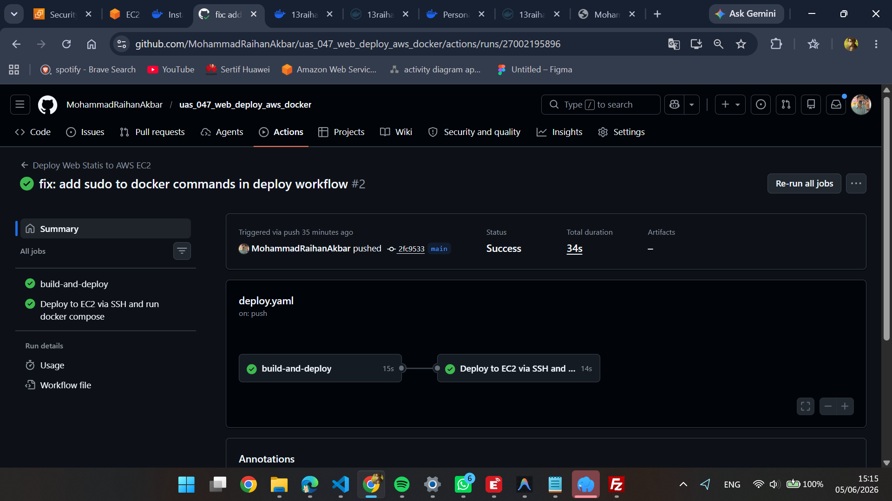
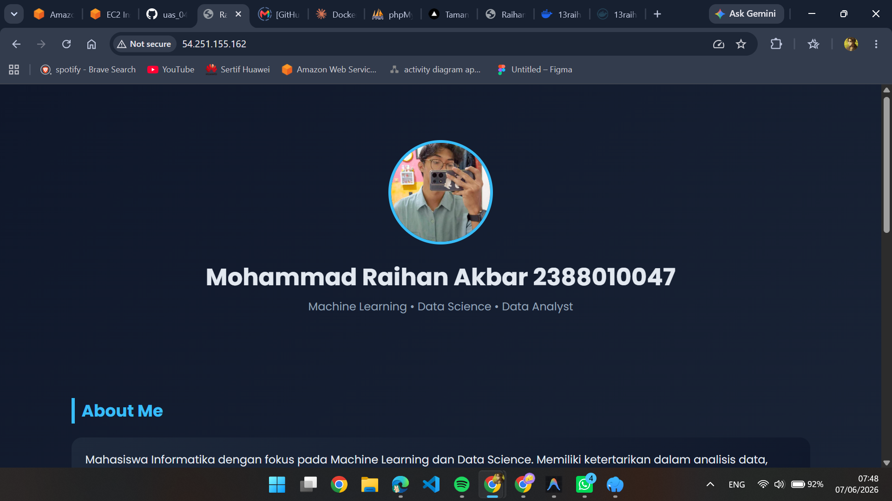
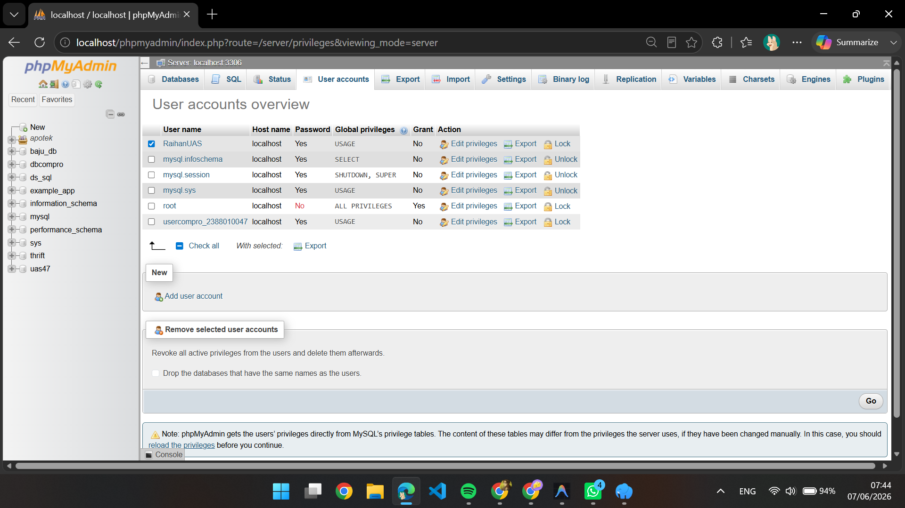
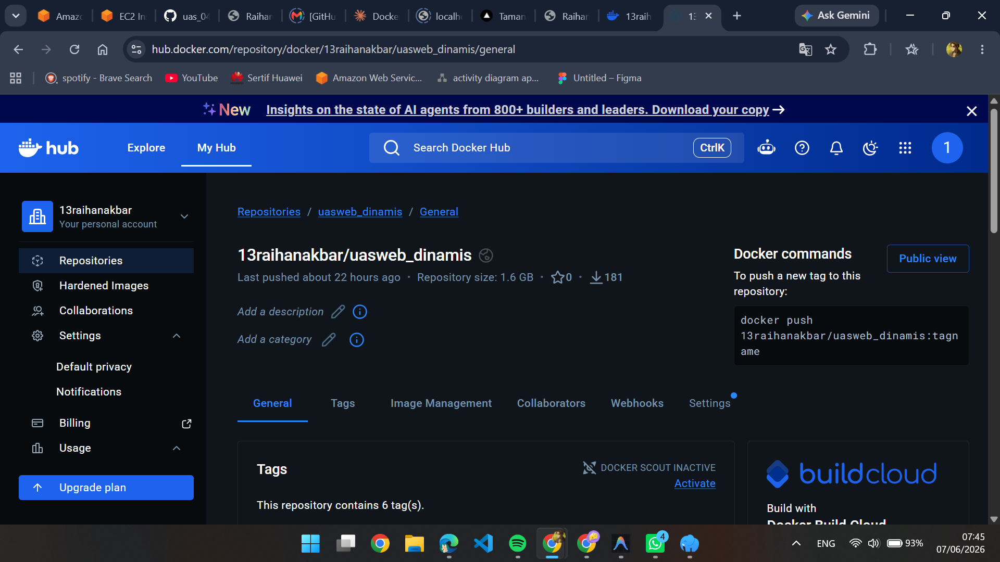
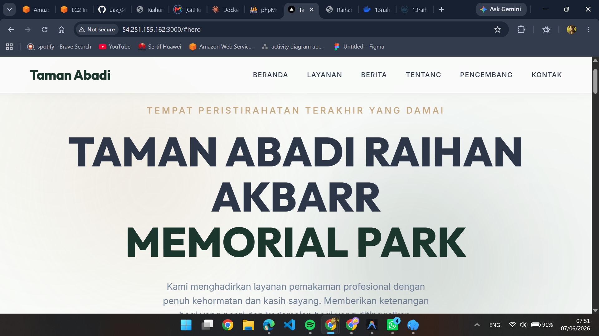
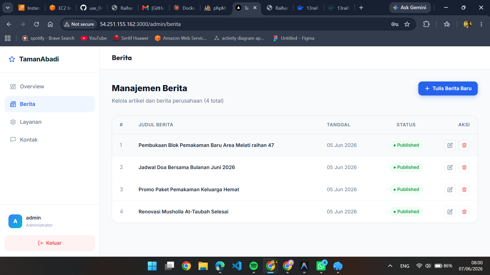

# UAS administrasi Server 6B Mohammad Raihan Akbar

## 1. Buat Instance Baru di AWS EC2

## 2. Add Security Group

## 3. Patching OS Ubuntu

## 4. Buat Repo Baru Github

## 5. Install Docker Engine di terminal ubuntu

## 6. Membuat Repo Baru di Docker

## 7. Membuat token access docker

## 8. Setting Secret_key Github

## 9. Deploy Web Statis

## 10. Deploy Web Dinamis

### A. Buat db baru uas47 dan buat user account baru RaihanUAS bberi privelleage untuk db uas47

### B. Buat repo docker untuk web dinamis

### C. buat Website dinamis dahuluu

- Buat Dockerfile yg menyesuaikan dengan bahasa dipakai disini saya pakai next.js
- Buat juga file docker-compose.yml di dalam folder web-dinamis
- terakhir buat deploy-web-dinamis.yml

### D. Deploy deh webnya dan buat perubahan sedikit untuk test

