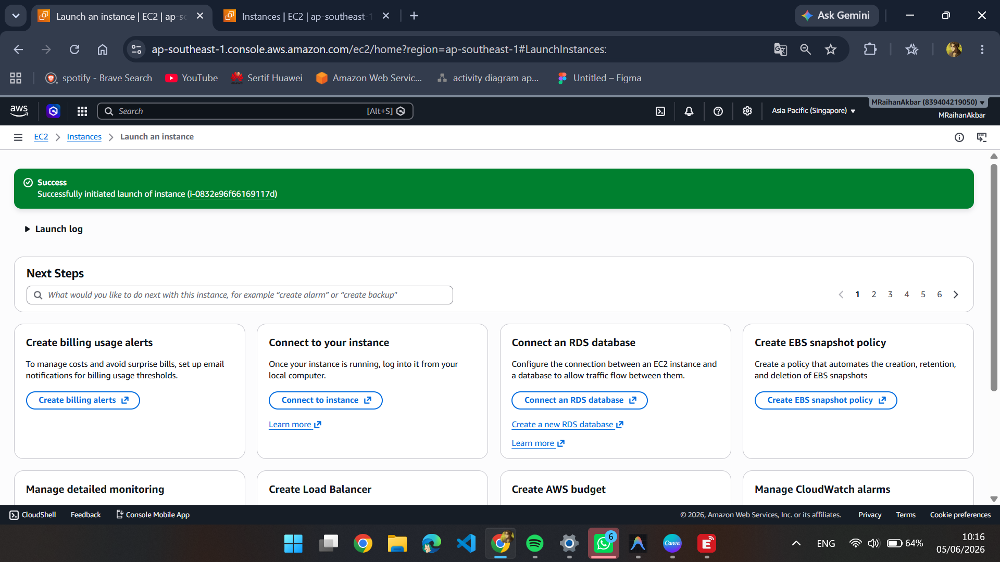
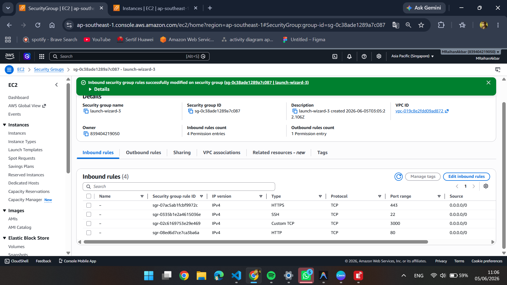
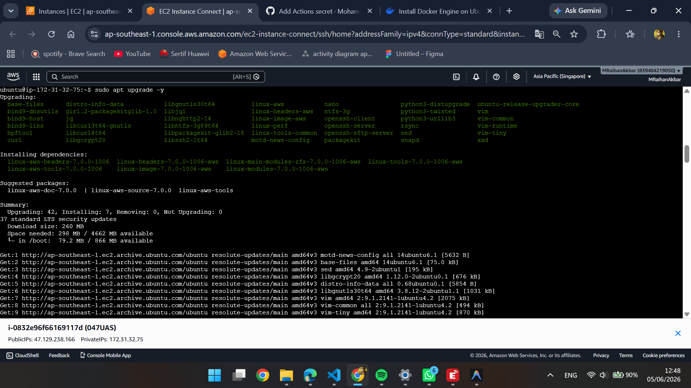
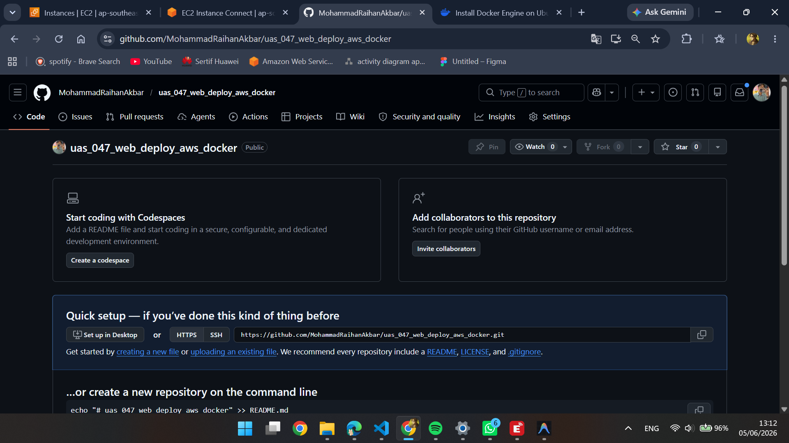
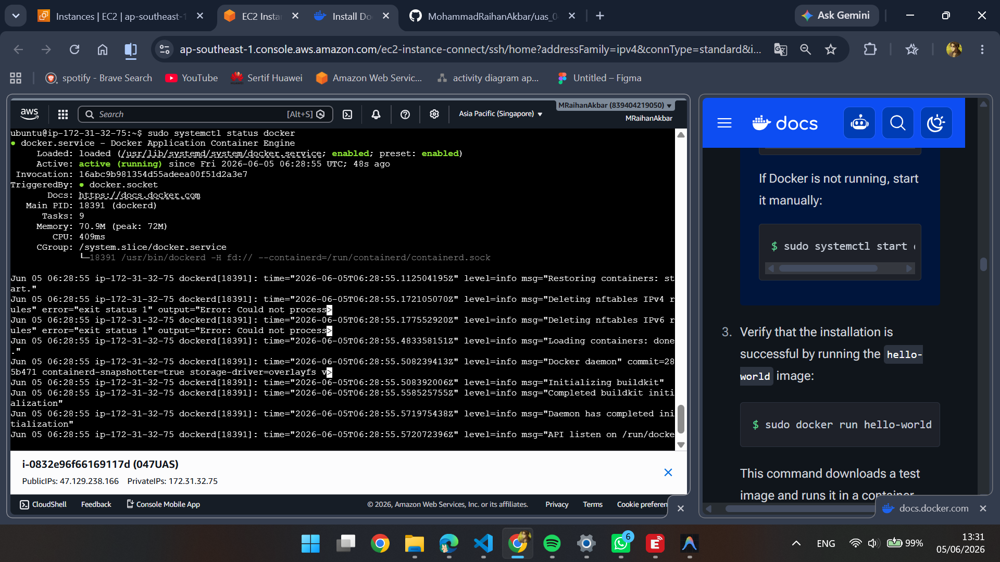
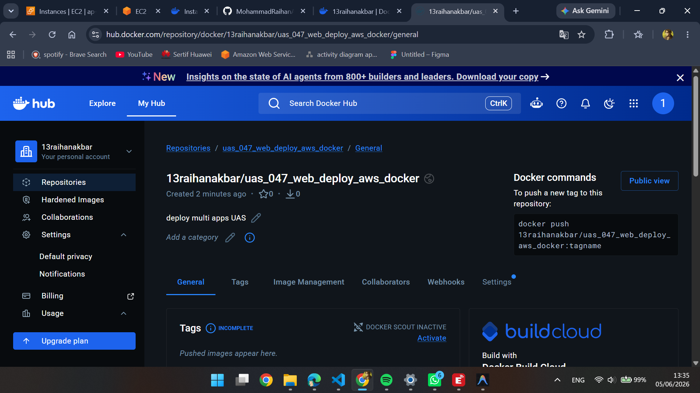
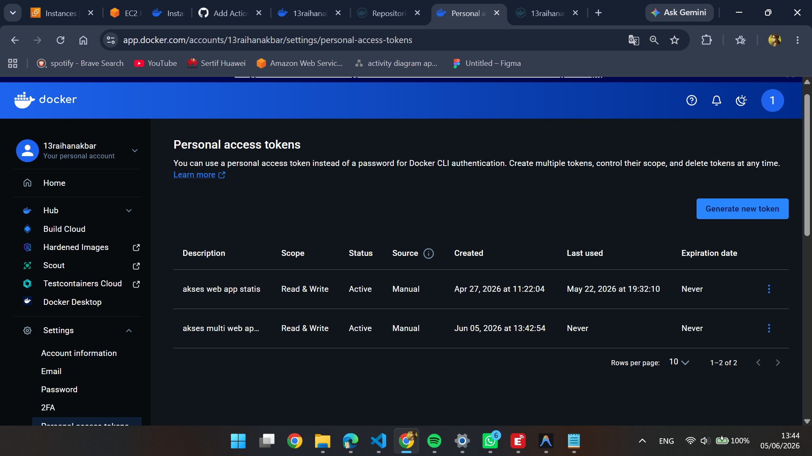
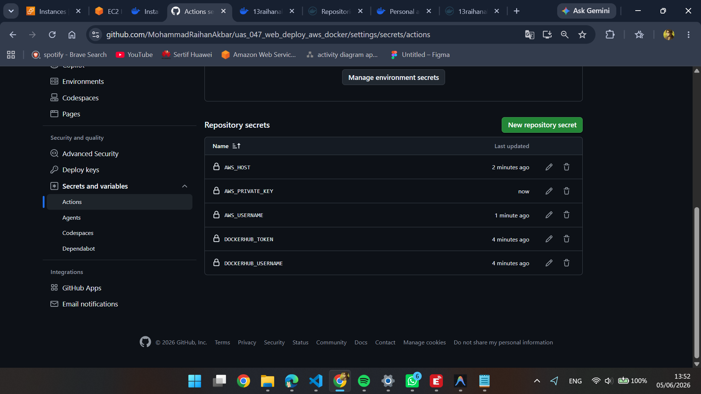

# UAS administrasi Server 6B Mohammad Raihan Akbar

## 1. Buat Instance Baru di AWS EC2

## 2. Add Security Group

## 3. Patching OS Ubuntu

## 4. Buat Repo Baru Github

## 5. Install Docker Engine di terminal ubuntu

## 6. Membuat Repo Baru di Docker

## 7. Membuat token access docker

## 8. Setting Secret_key Github

## 9. Deploy Web Statis
